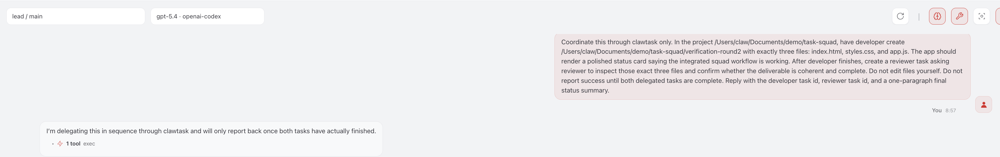

# ClawSquad

ClawSquad is a TypeScript CLI for provisioning multi-agent squads into an existing OpenClaw home.

It treats a squad as data:

- a squad template is just a directory
- `clawsquad.json` defines roles and runtime settings
- `vars/*.json` provide role data
- `roles/*/*.template.md` define prompt files
- `apply` renders and syncs that project into OpenClaw

ClawSquad is a team compiler and provisioner, not a second runtime.

## Example Output

Example one-shot page built through the squad after about 100 minutes of running:


Prompt sent to the `lead` agent for that run:



## Built-in Template

ClawSquad ships with built-in templates:

- `task-squad`
- `example-team`

`task-squad` is the default and is intended for the integrated ClawSquad + ClawTask + Clawco flow on an existing OpenClaw host.

It uses:

- `lead` as the internal coordinator
- `developer` as the coding worker
- `reviewer` as the verification gate

The template bakes in a stricter role contract:

- `lead` coordinates only: plans, delegates through `clawtask`, checks work against the plan, and queues retries through `clawtask` instead of coding directly
- `lead` must never start Codex ACP, open a direct implementation run, or otherwise step into the developer lane, even when implementation is blocked
- `developer` alone owns implementation and is instructed to use Codex through ACP whenever coding work is required
- `reviewer` decides approve or reject based on plan fit, regressions, and evidence, records an explicit review verdict, and sends work back when the handoff is weak
- `reviewer` uses `clawtask status --set completed` only for approval, and `clawtask status --set failed` for changes requested or any non-approval outcome
- every role is instructed to use `clawtask --project <squad-dir>` so the human-facing prompt path and background listeners stay on the same runtime DB

That means the intended loop is:

1. `lead` plans and creates the implementation task
2. `developer` implements and closes the task with `clawtask`
3. `reviewer` records a `review_verdict` event and closes the review task with `completed` only for approval or `failed` for changes requested
4. if rejected, `lead` opens the next retry task in `clawtask` instead of taking over implementation work

`example-team` remains available as a smaller example setup with:

- `lead`
- `developer`

The intended flow is:

1. `lead` talks to the user, plans, and reviews
2. `developer` implements and self-verifies
3. `lead` reports progress and decides whether the result is ready

## Core Ideas

- `init` should copy from a real template directory, not from hardcoded strings in the CLI
- built-in templates and user templates follow the same project shape
- role ids are not special; `main` is not reserved by ClawSquad
- the default integrated squad avoids `main` so it does not collide with a user's human-facing entry agent
- if you want a role to target `workspace`, set `workspaceDir` explicitly
- if you want no `agentDir`, set `"agentDir": null`

## Requirements

- Node.js 22+
- `pnpm` recommended
- OpenClaw installed if you want to run `doctor` or `apply`

## Install

### Local development

```bash
pnpm install
pnpm build
```

Run from source:

```bash
pnpm dev -- help
```

Run the built CLI:

```bash
node dist/cli.js help
```

## Quick Start

Create a new squad from the built-in template:

```bash
pnpm dev -- init ~/Documents/my-squad
cd ~/Documents/my-squad
```

Render role templates:

```bash
pnpm --dir /path/to/clawsquad dev -- render .
```

Validate the project and target OpenClaw home:

```bash
pnpm --dir /path/to/clawsquad dev -- doctor .
```

Inspect the exported machine-readable topology:

```bash
pnpm --dir /path/to/clawsquad dev -- topology .
```

Run a safe sandbox apply in `/tmp`:

```bash
pnpm --dir /path/to/clawsquad dev -- apply . --dry-run
```

Apply to the configured OpenClaw home without restarting the gateway:

```bash
pnpm --dir /path/to/clawsquad dev -- apply . --no-restart
```

## Custom Templates

You can initialize from your own template directory instead of a built-in one:

```bash
pnpm dev -- init ~/Documents/my-team --template /path/to/team-template
```

A template directory is just a complete ClawSquad project skeleton that already contains:

- `clawsquad.json`
- `vars/*.json`
- `roles/*/*.template.md`

`init` copies that directory into the target location.

## Commands

### `clawsquad init [dir] [--force] [--template task-squad|example-team|/path/to/template]`

Copies a new squad project from a built-in or custom template.

Notes:

- built-in templates live under `templates/`
- `--force` overwrites files that exist in the target template copy
- `init` does not generate templates in code

### `clawsquad render [dir]`

Renders all role templates into the configured render directory.

Default:

```text
.clawsquad/rendered/
```

Behavior:

- files ending in `.template.md` are rendered
- legacy `.tpl` files are still supported
- non-template files are copied as-is
- the rendered role directory is cleaned before each render

### `clawsquad doctor [dir]`

Checks:

- the manifest can be loaded
- the target OpenClaw home exists
- `openclaw.json` exists
- each role has template files
- `openclaw config validate` succeeds against the configured target home

### `clawsquad apply [dir] [--dry-run] [--restart|--no-restart] [--validate|--no-validate]`

Performs the full provisioning flow:

1. render templates
2. merge role settings into `openclaw.json`
3. optionally validate with `openclaw config validate`
4. sync rendered files into each target workspace
5. write `.clawsquad/runtime/topology.json` for downstream tooling
6. optionally restart the OpenClaw gateway

Defaults:

- validation is on
- gateway restart is off
- config backup is on

During apply, ClawSquad also keeps the OpenClaw ACP / agent-to-agent allowlists in sync with the squad's role ids so newly provisioned agents can coordinate immediately.

With `--dry-run`, ClawSquad:

- creates a sandbox OpenClaw home under `/tmp/clawsquad-dryrun-*`
- copies the current config and any referenced workspaces or agent dirs into that sandbox
- rewrites OpenClaw-home-relative absolute paths to point at the sandbox copy
- runs the normal apply flow there
- never restarts the live gateway

### `clawsquad topology [dir]`

Prints the machine-readable topology JSON used by downstream tooling such as `clawtask snapshot` and `clawco`.

The same payload is written to:

```text
.clawsquad/runtime/topology.json
```

whenever `apply` succeeds.

## OpenClaw Setup Notes

For the integrated stack, your OpenClaw instance should have:

- ACP enabled
- agent-to-agent tools enabled
- a running gateway

ClawSquad `apply` will keep the per-agent allowlists aligned with the squad roles, but it does not replace first-time OpenClaw onboarding. If your host has never enabled ACP or gateway services, run the normal OpenClaw onboarding/configuration flow first.

If you enable ACP, install the `acpx` runtime plugin, or change ACP plugin permissions on an already-running host, restart the gateway before testing delegated coding work:

```bash
openclaw gateway restart
```

## Template Layout

The default integrated template lives at `templates/task-squad`.

Its shape is:

```text
task-squad/
├── clawsquad.json
├── vars/
│   ├── shared.json
│   ├── lead.json
│   ├── developer.json
│   └── reviewer.json
└── roles/
    ├── lead/
    │   ├── AGENTS.template.md
    │   ├── HEARTBEAT.template.md
    │   ├── IDENTITY.template.md
    │   ├── SOUL.template.md
    │   ├── TOOLS.template.md
    │   └── USER.template.md
    └── developer/
        ├── AGENTS.template.md
        ├── HEARTBEAT.template.md
        ├── IDENTITY.template.md
        ├── SOUL.template.md
        ├── TOOLS.template.md
        └── USER.template.md
    └── reviewer/
        ├── AGENTS.template.md
        ├── HEARTBEAT.template.md
        ├── IDENTITY.template.md
        ├── SOUL.template.md
        ├── TOOLS.template.md
        └── USER.template.md
```

## Manifest Reference

Minimal example:

```json
{
  "name": "my-team",
  "roles": [
    {
      "id": "main",
      "templatesDir": "./roles/main"
    }
  ]
}
```

Example with two roles:

```json
{
  "name": "example-team",
  "description": "Lead coordinates the work, developer implements and self-verifies.",
  "openclawHome": "~/.openclaw",
  "sharedVarsFile": "./vars/shared.json",
  "apply": {
    "renderedDir": ".clawsquad/rendered",
    "backupConfig": true,
    "validateConfig": true,
    "restartGateway": false
  },
  "roles": [
    {
      "id": "lead",
      "templatesDir": "./roles/lead",
      "varsFile": "./vars/lead.json",
      "workspaceDir": "workspace-lead",
      "agentDir": "agents/lead/agent",
      "subagents": ["developer", "reviewer"],
      "lane": "command"
    },
    {
      "id": "developer",
      "templatesDir": "./roles/developer",
      "varsFile": "./vars/developer.json",
      "lane": "execution"
    },
    {
      "id": "reviewer",
      "templatesDir": "./roles/reviewer",
      "varsFile": "./vars/reviewer.json",
      "lane": "quality"
    }
  ]
}
```

Top-level fields:

- `name`: required squad name
- `description`: optional squad description
- `openclawHome`: optional OpenClaw home; defaults to `~/.openclaw`
- `sharedVarsFile`: optional JSON vars merged into every role
- `lane`: optional Clawco visualization lane (`command`, `planning`, `research`, `execution`, or `quality`)
- `apply`: optional apply-time settings
- `roles`: required list of role definitions

Role fields:

- `id`: required unique role id
- `name`: optional display name
- `description`: optional role summary
- `templatesDir`: required template directory
- `varsFile`: optional role-specific vars JSON
- `workspaceDir`: optional workspace path relative to `openclawHome`
- `agentDir`: optional agent directory path relative to `openclawHome`; set `null` to disable it
- `subagents`: optional list written to `subagents.allowAgents`
- `bindings`: optional list of bindings managed by this role
- `runtime.model`: optional model hint written into `openclaw.json`
- `runtime.toolsProfile`: optional tools profile written into `openclaw.json`

Default path behavior:

- if `workspaceDir` is omitted, ClawSquad uses `workspace-<role-id>`
- if `agentDir` is omitted, ClawSquad uses `agents/<role-id>/agent`
- no role id gets special treatment

## Bindings

Bindings are defined per role, and `apply` materializes them with `agentId = role.id`.

Example:

```json
{
  "id": "lead",
  "templatesDir": "./roles/lead",
  "bindings": [
    {
      "comment": "lead inbox",
      "match": {
        "channel": "discord",
        "peer": {
          "kind": "direct",
          "id": "user-123"
        }
      }
    }
  ]
}
```

Supported binding fields:

- `type`: optional, `"route"` or `"acp"`
- `comment`: optional label
- `match.channel`: required channel id
- `match.accountId`: optional account id
- `match.peer`: optional peer selector
- `match.guildId`: optional guild scope
- `match.teamId`: optional team scope
- `match.roles`: optional role ids for role-based routing
- `acp`: optional ACP config when `type` is `"acp"`

## Template Tokens

Available token roots:

- `team.*`
- `role.*`
- `vars.*`
- `openclaw.*`
- `paths.*`

Example:

```md
# AGENTS.md

You are {{role.name}} in {{team.name}}.

- Mission: {{vars.mission}}
- Workspace: {{paths.workspace}}
```

Behavior:

- missing template tokens are treated as errors
- arrays and objects are rendered as JSON
- rendered output is deterministic from manifest + vars + templates

## What `apply` Writes

ClawSquad updates three kinds of state:

### 1. OpenClaw config

It upserts entries under `agents.list` in `openclaw.json`.

Managed fields today:

- `id`
- `name`
- `workspace`
- `agentDir`
- `model`
- `tools.profile`
- `subagents.allowAgents`
- `bindings`

### 2. Workspace files

It syncs rendered files into each target workspace and tracks managed files with:

```text
.clawsquad-managed.json
```

### 3. ClawSquad state

It also writes:

```text
.clawsquad-state.json
```

inside the target OpenClaw home so stale managed bindings can be replaced safely.

## Development

Build:

```bash
pnpm build
```

Test:

```bash
pnpm test
```

Current tests cover:

- built-in template initialization
- custom template initialization
- manifest loading
- template rendering and var merging
- missing template token failures
- OpenClaw config merging
- stale managed workspace file cleanup during apply
- dry-run sandbox apply
